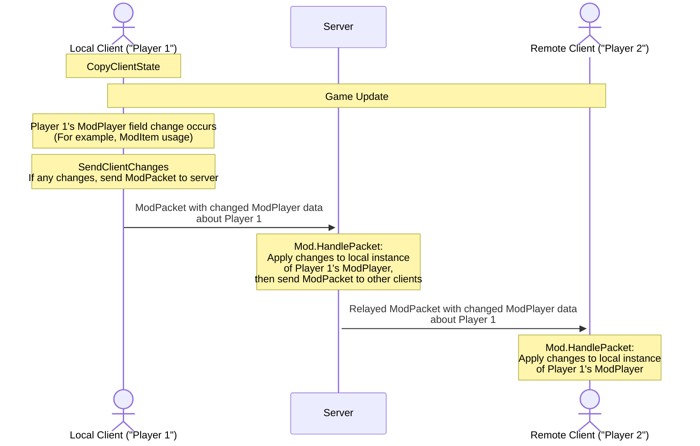

___
想要学习如何编写和发送您自己的ModPackets？请阅读我们的[中级网络代码指南](intermediate-netcode)。
___

# 简介
Terraria经常与服务器上的许多玩家一起玩。确保您的模组与朋友一起正常工作不是事后才想到的事情。在开发模组时尽早且经常在多人游戏中测试。在本指南中，我们将讨论如何使您的模组兼容多人游戏，并希望向您展示它并不像看起来那么困难。

# 主要概念
以下是理解Terraria在多人游戏中如何工作的关键主要概念。
1. 当您玩Terraria时，您的应用程序被视为并被称为"客户端"
2. 在多人游戏中，您的客户端和其他玩家的客户端连接到"服务器"
3. 连接到此服务器后，连接的客户端需要通过服务器良好地相互通信，以便游戏中发生的事情在这些客户端之间同步。

从本质上讲：网络数据包在客户端之间发送，以确保游戏对所有玩家保持同步。
这种情况在多人游戏中一直发生，即使原版也是如此。**客户端不能直接与其他客户端发送或接收东西——服务器必须充当中间人。**

# 测试网络代码/多人游戏兼容性
您可以通过托管服务器并让其他人加入您的服务器来测试多人游戏。模组应该自动从您的计算机同步到他们，即使您不在build.txt中更新版本。您不需要每次都发布到创意工坊来像这样测试，因为模组是直接从服务器来的。

## 在本地测试多人游戏

如果您想单独测试，您可以在这台计算机上启动2个tModLoader客户端。通常Steam只允许您启动游戏一次，但没有什么可以阻止您手动启动游戏第二次。要启动额外的客户端，打开tModLoader[安装目录](https://github.com/tModLoader/tModLoader/wiki/Basic-tModLoader-Usage-Guide#install)并双击`start-tModLoader.bat`文件（非Windows用户为`.sh`）。这将启动第二个客户端。您需要使用窗口模式而不是全屏模式。从那里，让第一个客户端"托管并播放"并在第二个客户端上使用"通过IP加入"。在第二个客户端上使用`localhost`作为IP地址。

如果您需要调试在服务器上运行的代码，您需要[启动调试器](https://github.com/tModLoader/tModLoader/wiki/Learn-How-To-Debug#launching-the-debugger)但选择"Terraria Server"启动目标而不是"Terraria"。如果这样做，您需要手动启动2个客户端通过"localhost"连接到该服务器。

请注意，使用2个客户端时，当程序不在焦点时游戏可能不会经常更新，因此您可能需要忽略某些明显的问题。

# 自动同步（非ModPacket）
Terraria为我们处理许多网络同步事情，我们只需要正确使用它们。

## NPC / ModNPC
对于NPC，任何非确定性决策都必须同步到客户端。服务器是所有NPC的所有者。如[ExampleCustomAISlimeNPC.cs](https://github.com/tModLoader/tModLoader/blob/stable/ExampleMod/Content/NPCs/ExampleCustomAISlimeNPC.cs#L222)所示，我们使用`npc.netUpdate`来触发NPC同步代码。每当`npc.netUpdate`设置为true时，Terraria会将位置、生命值和其他数据从服务器同步到客户端。我们可以使用[ModNPC.SendExtraAI](https://docs.tmodloader.net/docs/stable/class_mod_n_p_c.html#ab97269b1204781b8cbf396c31e604154)和[ModNPC.ReceiveExtraAI](https://docs.tmodloader.net/docs/stable/class_mod_n_p_c.html#abb7c4468cbdba533146c4e35f3299a69)来同步所有客户端需要的额外数据，而不是使用`ModPacket`。每当NPC本身被同步时，这些额外数据将始终被同步。

同步问题视频示例
<blockquote>

如`ExampleCustomAISlimeNPC.cs`所述，非确定性决策必须同步。如果AI代码中的随机选择值未正确同步，此视频显示发生的同步问题。注意 slime 如何在任一客户端上传送到服务器发送到客户端的正确位置，当NPC在常规间隔被同步时：

https://github.com/user-attachments/assets/27b289c0-37a6-47e8-9e35-ea6f641612f0

以下是正确行为，没有同步问题：

https://github.com/user-attachments/assets/f2bdcea4-8fe6-4eba-aa0d-0d36ade9a16d

</blockquote>

## Projectile / ModProjectile
弹幕的操作方式与NPC相同，但弹幕的所有者并不总是服务器。由玩家生成的弹幕由该玩家/客户端拥有，而所有其他弹幕（如NPC生成或世界生成的弹幕）由服务器拥有。对于客户端更改，`projectile.netUpdate`标志会将客户端的数据同步到服务器，服务器会将其转发给其他客户端。一个例子是[Magic Missile](https://terraria.wiki.gg/wiki/Magic_Missile)。AI将检查`if (Main.myPlayer == projectile.owner)`，然后如果位置因客户端玩家鼠标位置而更改，则设置`projectile.netUpdate = true`。

## World / ModSystem
世界数据只能且仅在服务器上更改。每当世界上发生重要事情时，例如服务器控制台上的Noon命令、Boss被击败或随机入侵触发，世界数据会从服务器同步到客户端。每当世界数据被同步时，每个`ModSystem`也会通过[NetSend](https://docs.tmodloader.net/docs/stable/class_mod_system.html#af9ebfea8b152b555b030265946cace70)和[NetReceive](https://docs.tmodloader.net/docs/stable/class_mod_system.html#a144ef598fa0b3bcc2a0ac6bd1c5467aa)同步。我们可以通过在服务器上调用`NetMessage.SendData(MessageID.WorldData);`来触发世界数据的网络同步，如[Abomination](https://github.com/tModLoader/tModLoader/blob/stable/ExampleMod/Old/NPCs/Abomination/CaptiveElement2.cs#L368)所示，当我们设置`ExampleWorld.downedAbomination = true;`时。请仅在必要时执行此操作。

## Item / ModItem / GlobalItem
物品也会同步。使用[`NetSend`](https://docs.tmodloader.net/docs/stable/class_mod_item.html#a80e9898e70b923e0a2a9b0d643504e8e)和[`NetRecieve`](https://docs.tmodloader.net/docs/stable/class_mod_item.html#a3d30fa657a2319543bdd619d2ad32f81)来同步数据。如果您需要做任何非正统的事情，请遵循反编译的源代码，大多数模组不需要做任何事情例如触发手动同步。当物品被同步时，只有非常精选的字段子集被同步，这就是为什么在`UpdateInventory`之类的东西中更改默认值如`Item.damage`不被推荐的原因。为此使用[`ModifyWeaponDamage`](https://docs.tmodloader.net/docs/stable/class_mod_item.html#a1f23f4899b8fd233d4cbfc7698bb34ba)。

物品在大多数相关情况下自动同步，例如当物品被丢弃或转移时，但可能需要特别考虑的一种情况是物品在玩家物品栏中更改时，会对玩家的行为方式或物品使用时的行为产生影响。如果没有同步，物品在由其他客户端观察时可能会有不同的行为。可以调用`Item.NetStateChanged();`方法来触发此物品栏或装备物品的重新同步。[UseStyleShowcase.cs](https://github.com/tModLoader/tModLoader/blob/stable/ExampleMod/Content/Items/UseStyleShowcase.cs)展示了这一点。当本地代码更改物品的行为方式时，代码确保更改被同步，以便所有客户端的行为保持一致。

## ModTileEntity
由服务器拥有。当客户端首次访问其所在世界的"区块"/"区域"时发送给客户端。更改在服务器上应用并从服务器同步到客户端。`ModTileEntity`代码可以通过发送`MessageID.TileEntitySharing`消息手动触发同步，这将导致当前值被发送到所有客户端以保持数据同步。请参阅[BasicTileEntity](https://github.com/tModLoader/tModLoader/blob/1.4.4/ExampleMod/Content/TileEntities/BasicTileEntity.cs#L66)获取示例。注意`WaterFillLevel` setter如何触发`MessageID.TileEntitySharing`被发送，以保持客户端同步。

## Player / ModPlayer
玩家数据非常大，因此使用特殊数据同步来最小化同步频率和必须同步的玩家数据。请参阅[ModPlayer文档](https://docs.tmodloader.net/docs/stable/class_mod_player.html)中的`SyncPlayer`、`CopyClientState`和`SendClientChanges`，并参阅[ExampleStatIncreasePlayer](https://github.com/tModLoader/tModLoader/blob/stable/ExampleMod/Common/Players/ExampleStatIncreasePlayer.cs)了解它们的用途和实际使用。原版`Player`数据（如物品栏槽、生命值、位置和选中的物品）都自动同步，因此在代码中更改这些会自动同步到服务器并转发到其他客户端。每个客户端的配饰都会在每个客户端上更新，因此也不需要同步配饰应用的效果。生物群落标志会自动同步。未能正确使用`SyncPlayer`和`SendClientChanges`将导致同步问题和许多其他问题，它们非常重要。

### CopyClientState和SendClientChanges
`CopyClientState`和`SendClientChanges`负责确保服务器和远程客户端与本地客户端的更改保持同步。如果有`ModPlayer`数据必须存在于服务器和远程客户端上以正确运行游戏逻辑，这些数据必须同步下图显示了它们如何协同工作。

首先，`CopyClientState`用于创建`ModPlayer`数据的快照。接下来，发生其余的游戏更新。在此期间，物品使用、UI交互或许多其他事情可能发生，可能会更改`ModPlayer`数据。接下来，调用`SendClientChanges`并使用该快照将当前`ModPlayer`值与快照`ModPlayer`值进行比较。如果检测到任何更改，模组会创建一个`ModPacket`并将更改的数据发送到服务器。服务器接收该数据，将其应用到该玩家的`ModPlayer`的本地实例，然后使用新的`ModPacket`将其转发到所有其他客户端。所有其他客户端接收该数据并将其包含的数据应用到该玩家的`ModPlayer`的本地实例。

# 多人游戏中的Hook
您需要知道各种"hook"在哪里执行。例如，一些hook只在服务器上运行，如`ModSystem.PostUpdateWorld`。一些hook只在客户端运行，如`ModProjectile.PreDraw`。一些hook在服务器和客户端上运行，如`ModProjectile.AI`。一些hook只为"拥有"实体的客户端运行，我们将其称为"本地客户端"，如`ModProjectile.CutTiles`。当hook区分本地客户端和其他客户端时，其他客户端被称为"远程客户端"。

[文档](https://github.com/tModLoader/tModLoader/wiki/Why-Use-an-IDE#documentation)中提到了许多方法的hook被调用的"位置"，但如果没有提到，您可以根据猜测或使用调试器或日志进行测试。除非是特定于网络同步的，否则可以假设所有hook也在单人游戏中调用。

在多人游戏的hook方面有很多事情需要记住，这里有一些常见的。在各处运行的hook通常需要在各处产生相同的结果，这意味着逻辑中使用的数据可能需要以某种方式同步。在所有客户端上运行的hook有时应该只应在本地或所有者客户端上运行代码，对于这些，检查`if (player.whoAmI == Main.myPlayer)`或某些等效项可能是限制代码运行位置所必需的。仅在客户端上运行的代码不应被用于游戏效果，例如不要将绘制方法用于游戏目的，因为它们不会在服务器上运行。如果某些内容在服务器和客户端上运行，可以使用`if (Main.netMode == NetmodeID.MultiplayerClient)`或`if (Main.netMode == NetmodeID.Server)`检查来限制执行到客户端或服务器。

# 改进和超越预定义的Hook
在ExampleMod中可以找到数据包的许多示例。例如，您可以使用Notepad++的"在文件中查找"功能并在ExampleMod文件夹中查找`GetPacket()`。确保选中"匹配大小写"和"在所有子文件夹中"。您将找到创建和可能发送数据包的所有位置。

如果您想更深入地学习如何发送ModPackets并进一步优化您的网络，请阅读我们的[中级网络代码指南](intermediate-netcode)。
