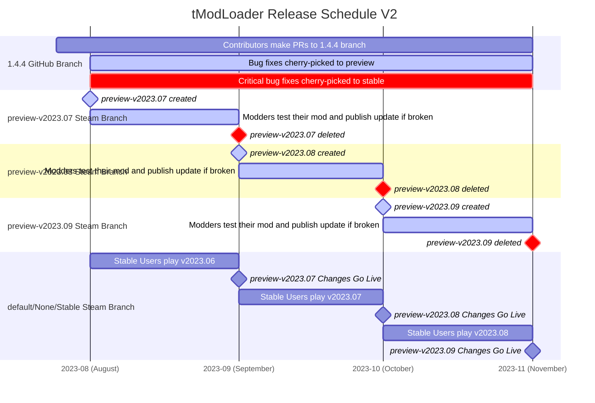

tModLoader目前有与Terraria 1.3、1.4.3和1.4.4+内容相对应的版本。
`1.3-legacy`版本将不再接收任何重大更新
`1.4.3-legacy`版本将不再接收任何重大更新
1.4.4+版本分为三个不同位置：
1. 用于开发构建的每夜1.4.4+ GitHub actions，
2. 预览GitHub Releases和相关Steam测试版（`preview-v2023.X`），用于tModLoader的预发布构建，不针对玩家，但对于将模组移植到即将发布的版本很有用
3. 稳定的GitHub releases并部署到Steam中的默认选项。这是绝大多数玩家会玩的地方，旨在让tModLoader更新带来的中断最少。

# 1.4.4+
1.4.4+ tModLoader正在积极开发中。这意味着代码经常变化，与早期版本的向后兼容性无法保证。普通用户应坚持使用tModLoader的"稳定版"（默认）。

## 发布周期V2（当前）
在每个月初，一个新版本的tModLoader将为稳定版（默认）玩家提供。
这个版本是一个月的开发成果的总结。
特定的月份以tModLoader版本号的YYYY.XX著称

为了让它进入稳定版并面向所有用户，它需要经历三个阶段：
1) 第1个月：（2023年6月制作的Version 2023.6）包括在Github的开发分支上进行的构建更改
2) 第2个月：（Version 2023.6，当前月份是2023年7月）包括tModLoader的预发布/ staging构建，可用于模组移植和发布测试。这个预发布构建很少会更新，因为它是一个"发布候选版"，因此任何更改都旨在不影响模组和玩家。它可作为GitHub Preview分支/Steam测试版（`preview-v2023.X`）使用
3) 第3个月：假设一切正常，我们将把预览版上的构建发布到稳定版，从而使其面向所有玩家成为一种稳定体验。

提醒：请不要催促模组制作者将他们 的模组提供给tModLoader的预览（预发布）版本。这是为了让他们在自己的时间表上为下一个稳定版发布准备模组的机会，不是tML或你的。

<!---下面的代码可用于在https://mermaid.live/edit上生成下面附加的.png。由于一些格式问题，必须手动编辑。如有需要，使用此代码进行重建。

-->

### 模组制作者说明
模组制作者应关注[tModLoader Discord](http://discord.gg/tmodloader)中的`#preview-update-log`，并查找与模组功能相关的重大更改。如果有**运行时中断**相关的列表，您应该加入`preview-v2023.X`分支并在下个月初之前发布更新，这样您的用户就可以继续无缝使用您的模组。如果相关更改仅列为**源代码中断**，则不紧急，您只需要在更改上线后遵循**移植说明**部分。

如果您不使用Discord，[更新迁移指南](https://github.com/tModLoader/tModLoader/wiki/Update-Migration-Guide)也将使用相同的信息进行更新。

## 发布周期V1 - 在1.4.3时代使用
在每个月初，一个新版本的tModLoader为稳定版（默认）玩家提供。
这个版本是一个月的开发成果的总结。
特定的月份以tModLoader版本号的YYYY.XX著称

在每个月的21日，我们暂停更新1.4-Preview，以给模组制作者一个更新模组的机会，确保他们的模组在1.4-Stable（默认）在下个月1日更新时能够正常工作。下面的图表可以帮助可视化这个过程：

## 稳定版（默认）
tModLoader的1.4稳定版（默认）每月初更新。这是Steam用户将收到的默认版本。如果您使用的是维护良好的模组，您应该不会遇到任何问题，但请注意，每个月都有您以前喜欢的模组可能被作者放弃的可能性。在这种情况下，您将不得不等待这些模组更新或禁用它们。

## 预览版
tModLoader的预览版是tModLoader的最新更改在进入稳定版（默认）之前进行测试的地方。tModLoader的这个版本是新功能测试的地方，所以事情偶尔会出问题。不要使用这个版本的tModLoader来进行正常的游戏体验。这个版本面向测试新功能的模组制作者和为那些模组制作者进行游戏测试的玩家。

**发布周期V2冻结：** 在开发月结束时，我们将捆绑所有更改并部署一个新的tModLoader预览版本作为候选发布。它将通过Steam测试版"Preview"选项在我们的staging环境中可用。从中断更改的角度来看它将被冻结，并将支持错误修复。从本质上讲，它将作为一个预览冻结期整整一个月可用，就像V1一样。

**发布周期V1冻结：** 每次我们在tModLoader中添加或更改内容时，tModLoader的1.4-Preview版本都会更新。在每个月的21日，tModLoader的1.4-Preview版本将停止更改，这是一个称为预览冻结期的时间。

在冻结期间，模组制作者应该更新他们的模组并在他们预期下个月初开始时发布更新（如果需要）。在下个月初，1.4-Preview将成为新的1.4-Stable（默认），所有用户都将更新。

如果好奇即将推出什么，这些[更改](https://github.com/tModLoader/compare/preview...1.4.4)将被引入Preview。

# 1.4.3-Legacy
1.4.3 tModLoader目前处于维护模式，因为我们所有的努力都集中在更新的tModLoader上。如果Terraria更新，1.4.3 tModLoader将被更新以考虑新的版本检查和破损的精灵，以保持游戏正常工作，但不会对1.4.3 tModLoader进行重大工作。

# 1.3-Legacy
1.3 tModLoader目前处于维护模式，因为我们所有的努力都集中在更新的tModLoader上。如果Terraria更新，1.3 tModLoader将被更新以考虑新的版本检查和破损的精灵，以保持游戏正常工作，但不会对1.3 tModLoader进行重大工作。
